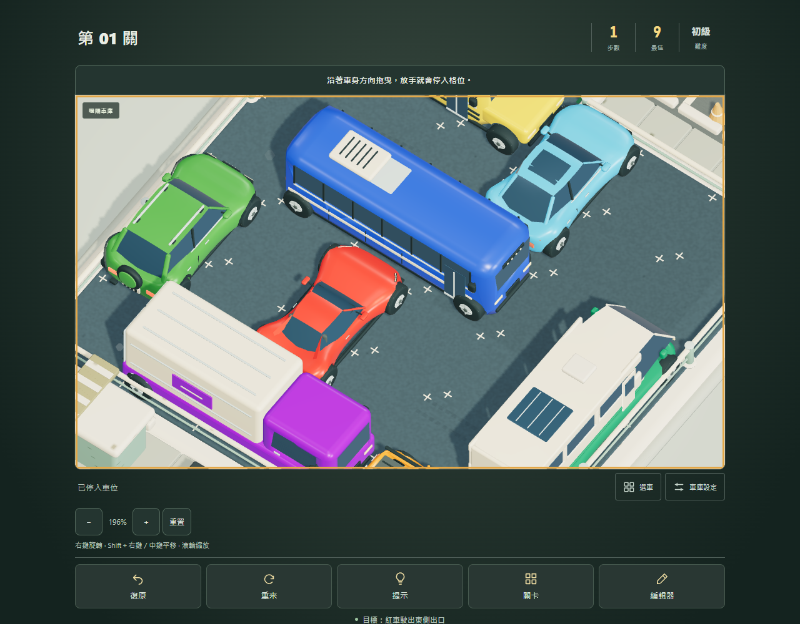
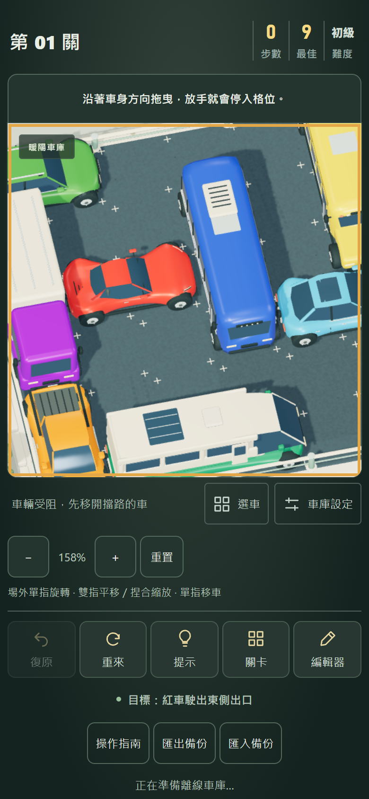

# 視角操作與驗證 · 2026-10-05

## 玩家操作

| 操作 | 電腦 | 手機 |
| --- | --- | --- |
| 移車 | 左鍵抓住車身拖曳 | 單指抓住車身拖曳 |
| 旋轉／俯視角 | 右鍵按住拖曳 | 單指拖曳停車場外的街景 |
| 平移畫面 | Shift＋右鍵拖曳，或中鍵拖曳 | 雙指拖曳 |
| 放大／縮小 | 滾輪，或畫面下方 ＋／− | 雙指捏合，或 ＋／− |
| 回到完整場景 | 重置 | 重置 |

移除了雙指旋轉／平移切換按鈕。手機單指起始位置以射線在實際 3D 地面上的交點判斷：停車場 0–6 格範圍內留給移車／編輯；場外且未命中車輛時才旋轉。手勢開始後鎖定用途，越過圍欄不會中途切換。放大到整個畫面都是停車場時，單指旋轉區可能不在畫面內；先縮小或按重置即可，雙指平移與縮放仍可直接使用。

縮放範圍 65%–400%，俯視角 30°–80°，可繞場景旋轉 360°。滾輪以游標、捏合以兩指中點為中心縮放；平移有邊界以免把場景完全拖出畫面。相機設定保存在原有瀏覽器偏好中，重置視角保留光源、主題、畫質和 120% 車身動態。

## 互動與效能

旋轉不再依新角度自動重新縮放入鏡：使用預設角度的固定構圖基準，只有滾輪、捏合或縮放按鈕改變尺度，視窗尺寸改變時維持對應長寬比。俯仰拖曳已鏡像反轉：往下拖提高俯視角、往上拖降低俯視角，左右方向維持原樣。原生輸入測試另比對旋轉前後的投影寬高，在 100% 及滾輪放大後均保持不變，手機場外單指亦同。

- 相機手勢只改相機與投影，每影格合併輸入；不在每次 pointermove 更新 React，也不重建車模、材質或陰影。
- 從移車加入第二根手指時，取消未提交的車輛移動，再開始平移／縮放。抬起其中一指後，剩餘手指不會變成移車或旋轉，需全部放開再開始。
- 第三根手指、失焦、頁面隱藏、切換關卡及開啟介面均有取消處理。編輯器的雙指手勢不會選定放車起點或放置車輛。
- 右鍵選單與滾輪預設行為僅在 3D 畫布內攔截；頁面其他部分仍可正常捲動。
- 遊戲內四步操作指南包含相機操作，提供可聚焦的縮放／重置按鈕。

## 本機驗證

`npm test` 七組測試與 `npm run build` 通過。相機純函式測試涵蓋限制值、角度環繞、像素平移與游標中心縮放。

`node scripts/verify-camera.mjs <CDP-WebSocket-URL>` 使用隔離 Chrome 的原生滑鼠／觸控事件：

- 右鍵旋轉、Shift＋右鍵／中鍵平移、滾輪縮放，均不增加移車步數。
- 旋轉／放大／平移後，實際抓取可見車輛並完成合法移動與復原。
- 手機場外單指旋轉、雙指平移、對稱捏合；平移／捏合不改旋轉角度。
- 首指已抓住綠車後再加入第二指，取消移車；抬指、第三指、touchCancel 與失焦不留下相機或車輛拖曳。
- 重載保存視角；390 px 與 320 px 無橫向溢出，按鈕高度至少 44 px。
- 編輯器雙指拖曳取消後零車輛且沒有放車起點標記。

原始結果見 [verification.json](verification.json)。已目視檢查以下實際遊戲截圖：

既有 `verify-resilience.mjs` 的編輯拖放、復原、檔案匯入、存檔失敗、鍵盤與暫時關卡回歸通過；`verify-touch.mjs` 的受阻、吸附、取消、三種畫質與第一關原生觸控九步通關通過。正式建置另外預算並重播全部 40 關解答。此次沒有重跑全部 40 關的瀏覽器滑鼠回放；此前版本完整回放與 GitHub Actions run 37293044625 已通過。

手機為桌面 Chrome 原生觸控模擬，尚待實體手機確認手勢手感與效能。WebGL 中斷時仍使用既有 2.5D 備援；新的自由相機操作用於 3D 場景。Three.js chunk 仍有超過 500 kB 的建置提示。
