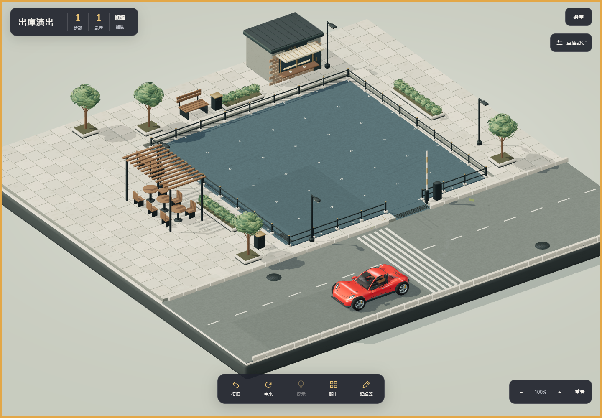
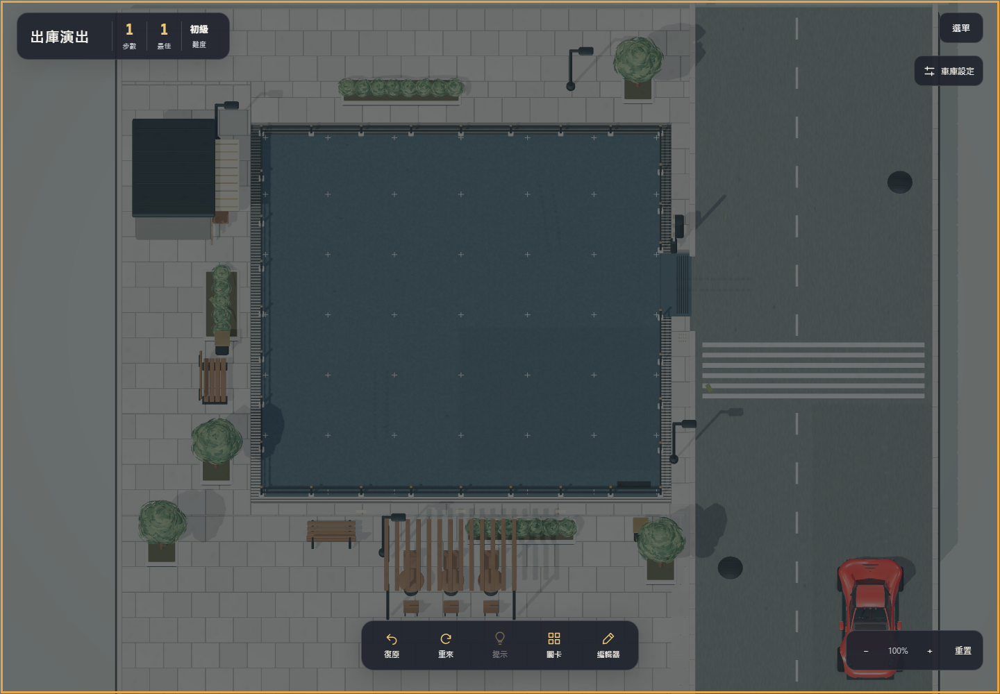

# 開放街道出庫演出

版本 `72a48efb`，修正前一版用路上建物遮住車輛的突兀感。

- 從可編輯 Blender 原檔、GLB 及產生腳本中移除七個通道構件。街道末端保持開放，方形場景尺寸與既有街景保持一致。
- 保留後軸路徑與內外前輪轉角。紅車轉彎後繼續前進，4.85–5.35 秒淡出整個街景鏡頭；在 5.40 秒、全畫面遮蔽後才切掉車輛。
- 車子在淡轉前沒有煞停，仍在完整道路範圍內。5.65 秒觸發通關，鏡頭在通關面板背後平順恢復，最遲 6.25 秒完全顯示街景。
- 減少動態模式維持快速通關且不使用鏡頭淡轉。鏡頭設定及玩家縮放維持原值，重玩／返回編輯器會清除轉場。
- 轉場平面只在通關期間可見，一次 draw call；正常遊玩不繪製它。先前的光照、陰影與模型優化保留。

## 驗證

`npm test` 及 production build 通過。模型射線檢查確認街道末端沒有屋頂／牆體，數值測試確認所有可見車輛姿態都在道路上，車輛切除時鏡頭完全遮蔽。

Chrome 原生滑鼠與模擬觸控操作驗證桌面、手機尺寸與低仰角：持續轉向／前進、淡轉、通關時機、鏡頭回復、重玩、減少動態、編輯器試玩返回及正式關卡下一關。另檢查日景、黄昏、夜景、反向、低角度與放大視角。

原始動畫取樣及操作結果：[results.json](results.json)。完整場景檢查：[art/inspection.json](art/inspection.json)。

