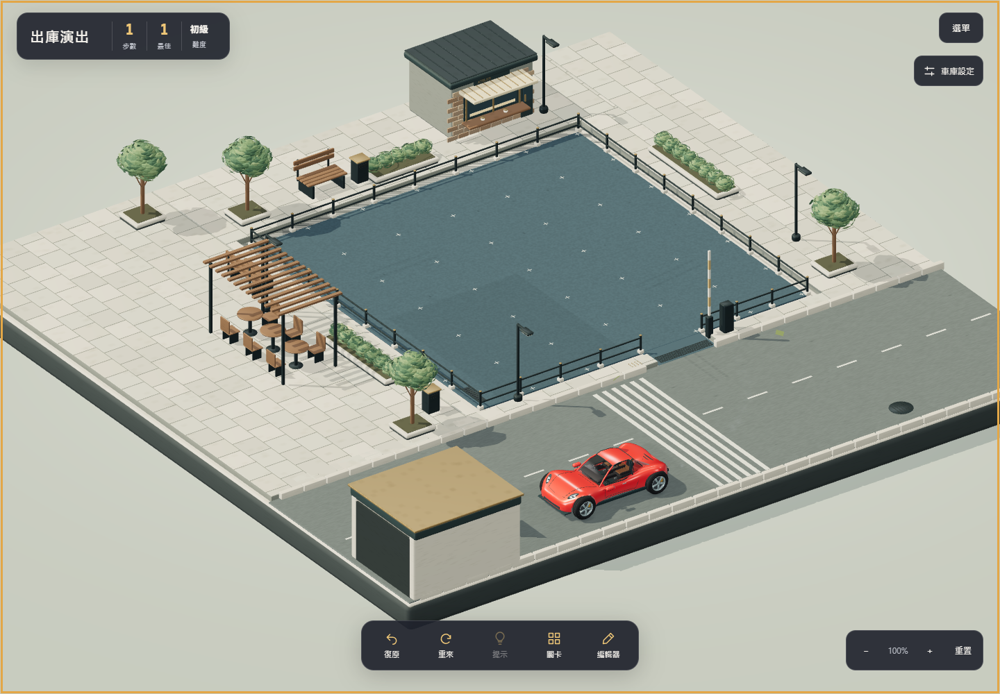
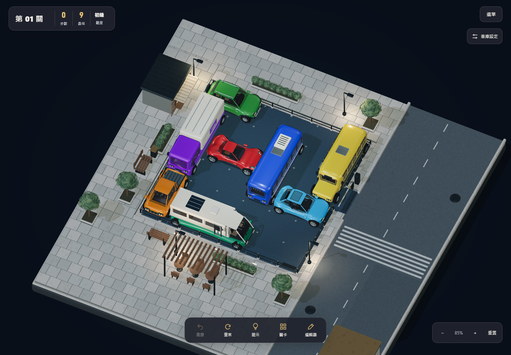

# 車輪轉向、真正駛離與繪製優化

版本 `e2ce4c5a`。保留方形街區、精緻預設畫質及原有 40 關解謎規則。

## 轉向與出口

- 路徑改為後軸中心行進，車身中心隨朝向偏移；以前直接讓車身中心沿彎道走，與前輪的轉角關係不一致。
- 依 1.33 格軸距、0.86 格輪距計算 Ackermann 內外輪角度，共用輪心樞軸；最大內輪轉角約 34°，外輪約 25°。進彎、出彎曲率漸變，後輪保持正向。
- 紅車持續駛入街道末端的有頂通道，整輛車進入遮蔽區域後才隱藏。沒有在道路上煞停，也沒有從開放路面突然消失。減少動態偏好保留快速通關方式。
- 移除出口綠色虛線及通關發光動畫。隱藏車輛後停止它的實體燈光與煙霧發射。

參考：[MathWorks Ackermann 後軸座標與內外輪幾何](https://www.mathworks.com/help/robotics/ref/ackermannkinematics.html)、[Vehicle Physics Pro 的輪心位置、車輪／卡鉗轉向與視覺配置圖](https://vehiclephysics.com/components/wheel-collider/)。這是解謎遊戲的車輛運動學演出，並非引入完整汽車動力學引擎。

## 優化方式

- 背景在不透明街區之後繪製，遮住的背景像素不再執行材質著色。背景保留天空、太陽和街區陰影，省去街區局部光源計算。
- 保留所有街燈／車燈、玻璃、清漆與材質參數。Three 判定局部光源照不到的像素時，跳過零貢獻的完整 PBR 直接光計算。
- 精細輪胎、輪框、煞車盤仍在畫面中。陰影只繪製同輪心、同轉角的四個輪胎輪廓；附在原本的頂點批次中，使用 shadow hooks 切換並恢復 draw range，不增加 draw call。
- 細葉保留折面與雙面照明，移除封閉底面。街區 GLB 從 4,799,908 bytes 降至 3,070,360 bytes。
- 未降低畫質設定、渲染解析度、陰影貼圖尺寸或 FPS 上限。

## 驗證

`npm test` 與 production build 通過。實際 Chrome 原生滑鼠及觸控輸入驗證：桌面／手機尺寸／低仰角出庫、結果時機、視角回復、重玩、減少動態、試玩返回編輯器、正式第一關與下一關。八種精緻畫質截圖涵蓋日景、黃昏、夜景、低角度、反向視角、放大細節及手機尺寸，沒有 JavaScript／shader 錯誤。

原始通關資料：[results.json](results.json)。畫面與靜止／背景狀態資料：[art/inspection.json](art/inspection.json)。靜止 FPS 保持 30，靜止不重繪陰影；背景分頁停止繪製。

## 效能比較條件

使用同一台 Windows、Chrome headless、同一關卡與原生連續拖曳輸入。基準是前一版 `ef261e66`。標準畫質：桌面 1280×900 DPR 1，手機尺寸 375×800 DPR 1.5。每次測試使用 WebGL GPU timer，分開記錄 idle 與 active。關閉本輪其他測試瀏覽器後才採用最終 after 數據，避免背景重複渲染干擾；迭代測試數字不作結論。

手機尺寸是桌面瀏覽器模擬，並非實體 iPhone／Android 測試。GPU 耗時中位數不能換算為保證 FPS；完整尾端延遲及輸入延遲保留於原始資料。

原始比較：[before.json](before.json)、[after.json](after.json)。

| 連續拖曳場景 | GPU 中位數，前 → 後 | GPU p95，前 → 後 |
| --- | --- | --- |
| 桌面白天 | 28.96 → 14.84 ms（降低 49%） | 52.38 → 46.24 ms |
| 桌面夜景 | 44.63 → 24.73 ms（降低 45%） | 61.78 → 48.98 ms |
| 手機尺寸夜景 | 25.34 → 11.24 ms（降低 56%） | 48.25 → 30.09 ms |

CPU 拖曳中位數依序為 2.4 → 2.4、2.7 → 2.5、2.5 → 1.9 ms。指標並非全面改善：input-to-submission 的 p95 在桌面白天及手機尺寸分別由 4.5／4.7 ms 增至 18.4／20.7 ms，夜景桌面由 5.1 降至 4.8 ms；下一輪若針對操作延遲，仍應在實體裝置長時間量測與檢查事件／RAF 排程。沒有宣稱所有裝置能穩定 60 FPS。
