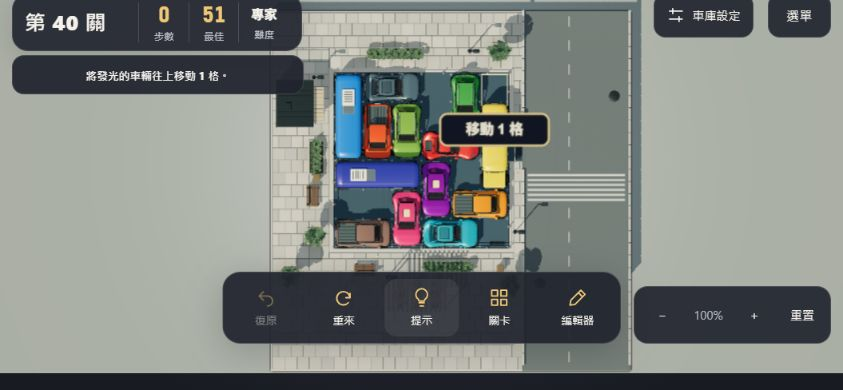
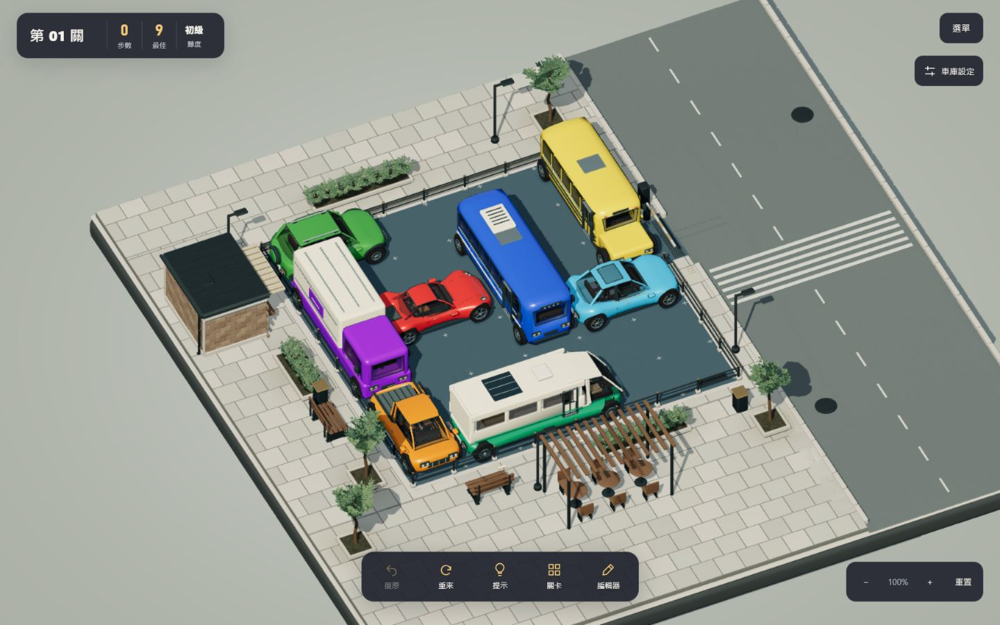

# 短螢幕取景與步道材質打磨

2026-10-10；分支 `feature/game-feel`，完成版 `29f9a728`。

## 改動

- 短直向手機與橫向小螢幕依實際 HUD／下方控制列位置計算取景安全區域，棋盤在預設視角完整露出。保持 90° 俯視、使用者縮放與平移設定；桌機及一般長直向手機沿用原構圖。
- 橫向短螢幕的提示文字安排到棋盤左側，不再橫跨上排車輛。
- 編輯器模式切換時重新量測控制列，避免在編輯器調整視窗尺寸後返回遊戲仍使用過時布局。
- 步道石磚以固定位置種子增加輕微逐塊明暗／冷暖差；稍加深凹陷接縫。顏色烘入原有合批頂點，沒有增加步道 draw call。
- 樹池與花槽周圍加柔和局部積塵色階，沿用地面遮罩空出的 alpha 通道；6×6 棋盤內保持原樣。雨後反光、穩定陰影、植栽動態、車輛與通關動物保留。

本輪沒有新增背景交通或改夜景；依先前討論，先完成工具列避讓與材質細修，再評估下一輪場外動態。

## 驗證

- 17 組現有測試全數通過；補充安全區投影邊界檢查與棋盤內積塵遮罩為零的檢查。
- 正式 build 成功，含 40 關解答預計算及重播。既有大 chunk 提醒仍存在，沒有建置錯誤。
- 瀏覽器檢查 1440×900、390×844、320×568、844×390；不是實體手機效能或觸控測試。
- 第 40 關原先被遮住的底排青色車，橫向拖動一步後可復原回零步；編輯器內切換尺寸、返回小手機遊戲後也可拖動並復原。
- 完成版在獨立 origin `http://127.0.0.12:4173/`，第 01 關實際九步通關，等待出庫到動物結果面板，按下一關並確認第 02 關零步。
- 比較白天與雨後展示視角、省電模式；未見新的黑塊或鏡面瀝青。未做 GPU 時間量測，不宣稱效能提升。
- 完成版瀏覽器 console error 為空陣列；選單版本 `29f9a728` 與 dist 相符。

## 截圖

以下均為本輪實際預覽截圖。01–06 為同一輪候選建置，與完成版具有相同的材質及預設安全取景；完成版另外補上橫向提示與編輯器模式切換量測，由 07–10 驗證。

| 證據 | 內容 |
| --- | --- |
| [01](01-small-mobile.png)／[02](02-small-dense.png) | 320×568，初級／專家配置底排露出 |
| [03](03-landscape.png) | 844×390，控制列在棋盤下方 |
| [04](04-day-showcase.png) | 與上一輪相同展示角度的步道與街角 |
| [05](05-rain-showcase.png)／[06](06-saver.png) | 雨後反光與省電外觀 |
| [07](07-mobile.png) | 390×844，一般手機構圖保留 |
| [08](08-landscape-hint.png) | 完成版橫向提示靠左，底排完整 |
| [09](09-editor-return-small.png) | 編輯器調整尺寸後返回小手機遊玩 |
| [10](10-win.png) | 完成版實際九步通關，動物與結果卡保留 |

