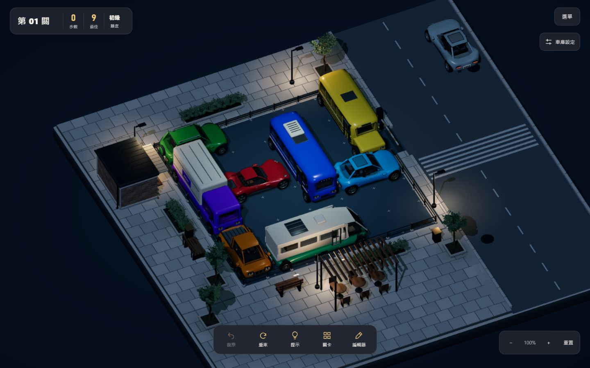

# 場外交通與夜景細修

2026-10-10 開始，2026-10-11 完成；分支 `feature/game-feel`，版本 `a818955c`。

## 改動

- 外側道路低頻出現一輛既有精緻 compact 車款，單車重用，車輪隨行進轉動。第一輛在允許動態後約六秒開始，其後每次通過約七秒、間隔 22–34 秒；進出道路端點淡入淡出。
- 車輛固定走遠離棋盤的外側車道；通關或開啟設定時，現有背景車在約 0.18 秒內淡出並停止新車進場。編輯器、省電、減少動態停用；分頁背景由既有渲染暫停機制處理。
- 共用車輛雨景材質；夜間前後燈僅外部燈片發光。使用柔和接地陰影，不新增移動投影、點光源或反射探針。
- 夜景背景地面增加低強度藍灰漸層，中央補光略加寬、柔化並增強，讓外緣與深色車輪廓較可辨識。其餘主題不加背景發光。
- 保留關卡難度、棋盤尺寸、操作、動物、穩定陰影與既有雨後效果。

## 驗證

- 18 組測試全過；新增背景車等待、行進、通關清場、停用與共用資產不被修改／資源釋放測試。
- 正式 build 成功，含 40 關解答預計算與重播；既有大 chunk 提醒仍在。
- 隔離 origin `http://127.0.0.13:4173/`，透過 UI 匯入前輪合成 20 關進度解鎖夜景，並非本輪人工完成 20 關；使用者平常 origin 的存檔未修改。
- 最終建置檢查日景、雨後、夜景、展示角度、精緻／省電切換，1440×900、390×844、320×568、844×390。手機為瀏覽器尺寸模擬，未做真機 GPU／觸控或 FPS 量測。
- 實際拖曳九步完成第 01 關、等待出庫與動物結果面板，下一關第 02 關初始化零步。沒有逐關人工玩完全部關卡；通關同時有背景車的清場條件以單元測試驗證。
- 最終 UI 選單版本 `a818955c`；PWA 使用「更新並重新開啟」完成更新，進度保留。捕捉到的 console error 為空。

## 截圖

最終建置：

- [夜間背景車](night-traffic.png)：第 01 關展示角度，車行經外側道路，尾燈可見。
- [深色車款夜景](night-display.png)：第 02 關展示角度。
- [手機雨景](phone-rain.png)、[小手機](small-phone.png)、[橫式](landscape.png)。
- [實際出庫](exit.png)、[動物通關](win.png)、[下一關零步](next.png)。

`day-initial.png`、`day-street.png`、`night-top.png` 為同輪候選建置，尚未補背景車燈與共用雨景材質；夜景補光與背景漸層已與完成版相同。

