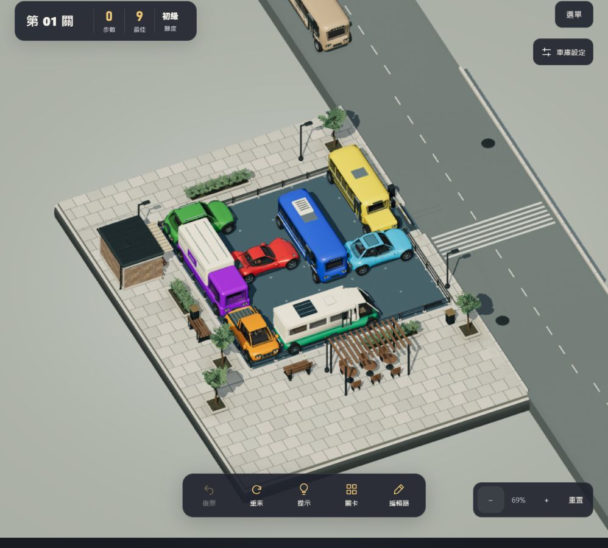
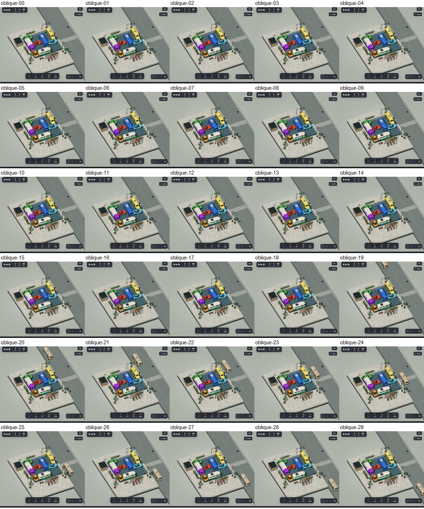

# 車輛完整進出畫面

日期：2026-10-11。分支 `feature/game-feel`，最終版本 `c8e3b199`。

使用者指出道路端點裁切會露出內裝剖面，並擔心直接移除裁切會讓車輛突然出現。

- 移除道路端點對車模的切面裁切，正常行駛保持完整不透明；通關優先清場仍共用整車覆蓋淡出。
- 道路與分隔線延伸出畫面，沿用既有瀝青、雨景與標線材質，不重建車模與棋盤。
- 按目前相機可視範圍及完整車身包圍球計算兩端，整車在畫面外生成、駛入、駛離後才移除。旋轉／縮放時，行進中車輛的終點可向外延伸，位置與速度不中斷。
- 保留六車款、車色、雙向分道、不同快慢與輕微加減速，最多兩車與既有停用條件。畫面內路段速度範圍延續前版；整趟時間隨可見道路長度而變，不再固定宣稱 3–5 秒。

18 組測試與正式 build／40 關解答重播通過。新增測試覆蓋 pitch 30／45／90、yaw 0／45／90／180、zoom .65／1／4 的兩車道及長短車：起終點完整包圍球均不與可視範圍相交；正常行駛不淡入，縮小視角延後離場。

隔離 origin `.16` 的候選版 `a118aaba`：桌機 998×900、展示角 69% 連續 30 張（400ms 間隔），巴士從畫面上緣完整駛入再由另一側離開；另查 30°／180°／65% 視角、390×844 瀏覽器尺寸與雨景，捕捉 console error 為空。截圖及連續縮圖見本目錄。最終版只追加測試，遊戲程式相同；另以 `.17` 載入最終版，選單確認 `c8e3b199`，俯視 69% 連續 24 張（400ms 間隔），可見小車向上、巴士向下通過，各為完整車身，捕捉 console error 為空。未宣稱真機或 FPS 驗證，本輪未再次人工通關 40 關。

