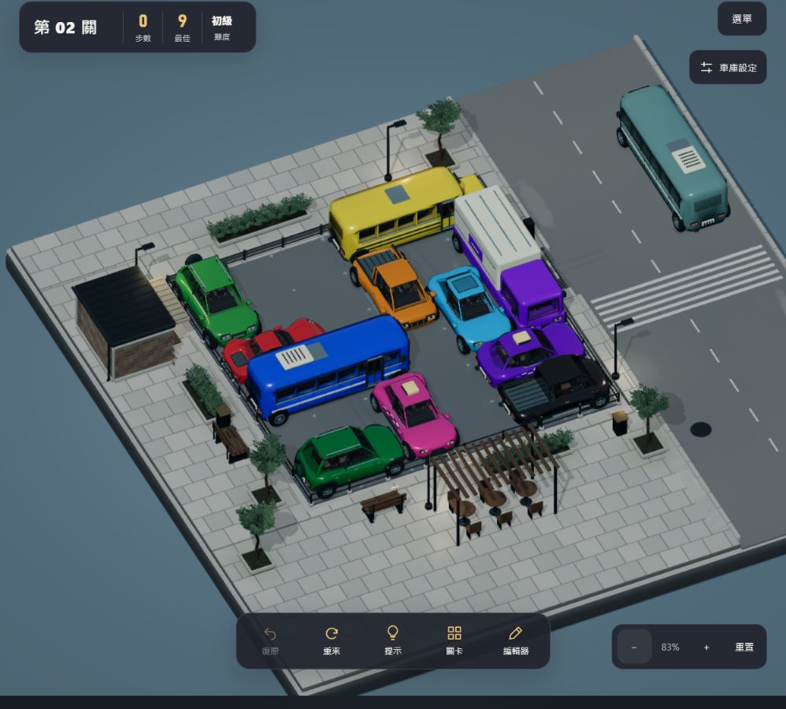
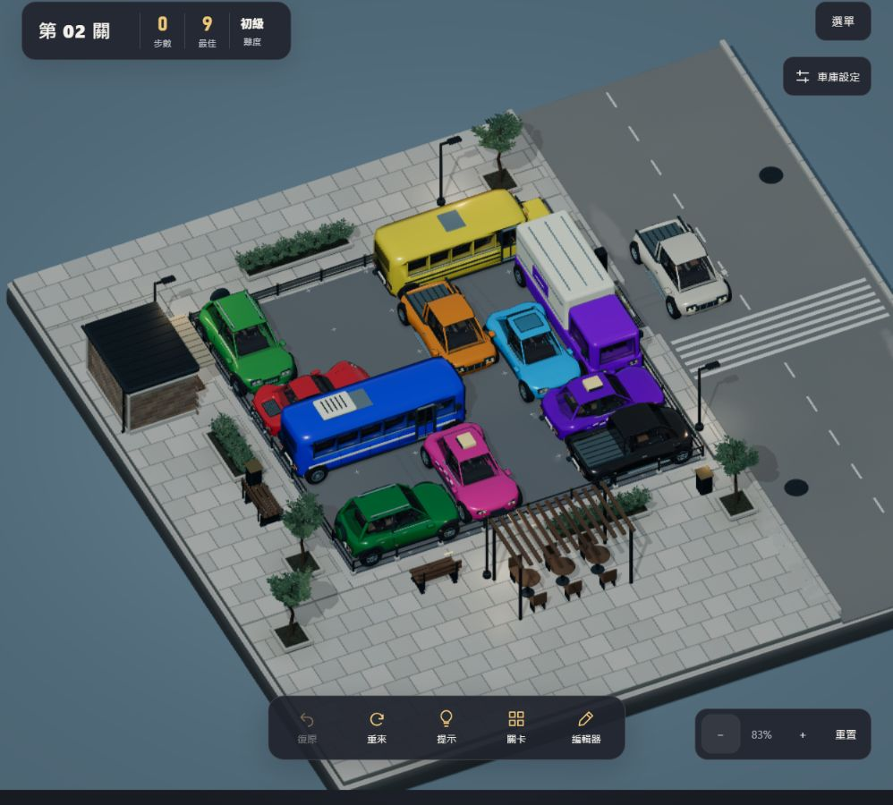

# 路過車流修正與驗證

日期：2026-10-11。分支：`feature/game-feel`。最終遊戲版本：`4f36e2c7`。

## 修正

- 舊淡出把車殼轉為透明並關閉深度寫入，與玻璃的獨立透明處理衝突，造成內裝先浮現。改為各材質共用的像素覆蓋與道路端點裁切；車殼維持不透明與深度遮擋，玻璃保留原有光學透明度。
- 六種既有精緻車款（小車、休旅、皮卡、計程車、貨車、巴士），每輪隨機排序，各車款另有車色選擇。雙向分道，最多兩車、每道一車，避免相撞或同向穿越。
- 提升速度，每趟約 3.25–5.28 秒，依車型與隨機速度而異；每趟另外隨機輕微加速或減速，始終向前。車輪依行進距離滾動。
- 六車材質在開始遊玩前預先編譯，重用既有模型與雨景材質。通關優先清場，編輯器、省電、減少動態保持停用。不改關卡、小動物、紅車出庫與穩定陰影。

## 驗證

- 18 組測試通過；正式 build 通過，40 關解答重播通過。新交通測試涵蓋車款輪替、車道、速度差、單向單調行進、清場、材質遮擋與資源釋放。
- 候選版 `bc3c609f`：以實際瀏覽器連續半秒截圖檢查晴天、俯視、雨景、夜景；實際第一關九步通關，下一關零步。`win.png`、`next.png` 與 `contact-sheet.jpg` 留存當輪證據，部分夜景截圖右側受截圖寬度限制。
- 最終版 `4f36e2c7`：補入預先編譯與缺省接地貼圖處理後，重跑測試與 build；確認載入成功，雨景 998×900 連續 24 張 `final-flow-00` 至 `23`，可見巴士與皮卡分別走兩個方向；`final-flow-08.png`、`final-flow-20.png` 為清楚的完整車身。
- 最終版瀏覽器 390×844、320×568 尺寸及省電模式見 `final-phone.png`、`final-small.png`、`final-saver.png`。捕捉到的 console error 為空。
- 使用隔離 origin `.14` 與前輪既有 `.13` 測試資料；未改日常 origin 的玩家進度。手機尺寸為瀏覽器驗證，未作實機或 FPS 量測；40 關為自動解答重播，非逐關人工遊玩。

