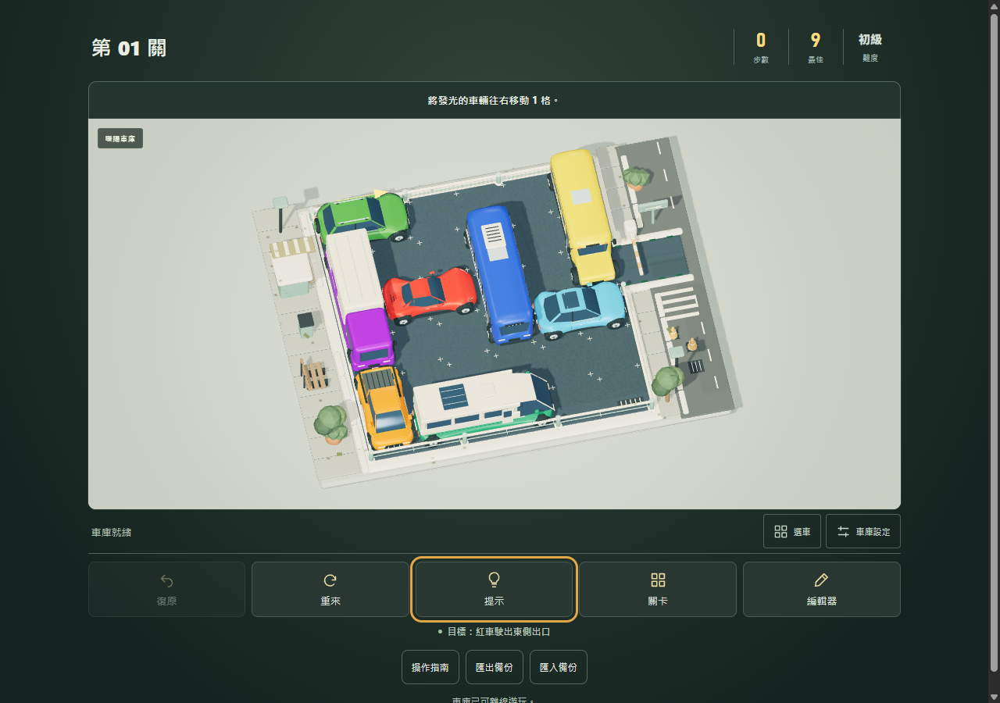
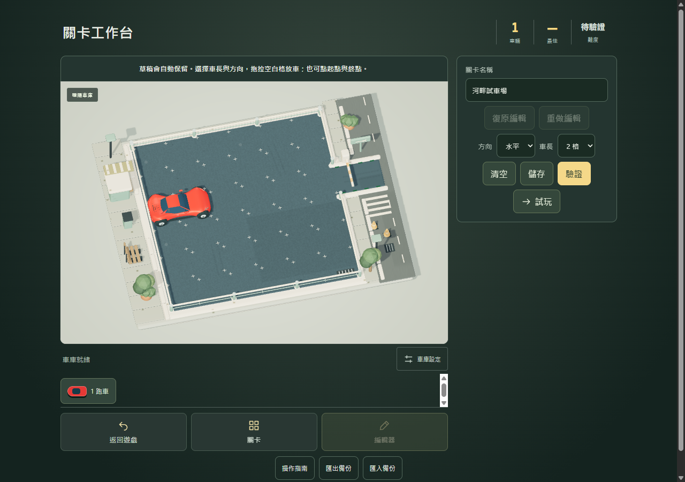
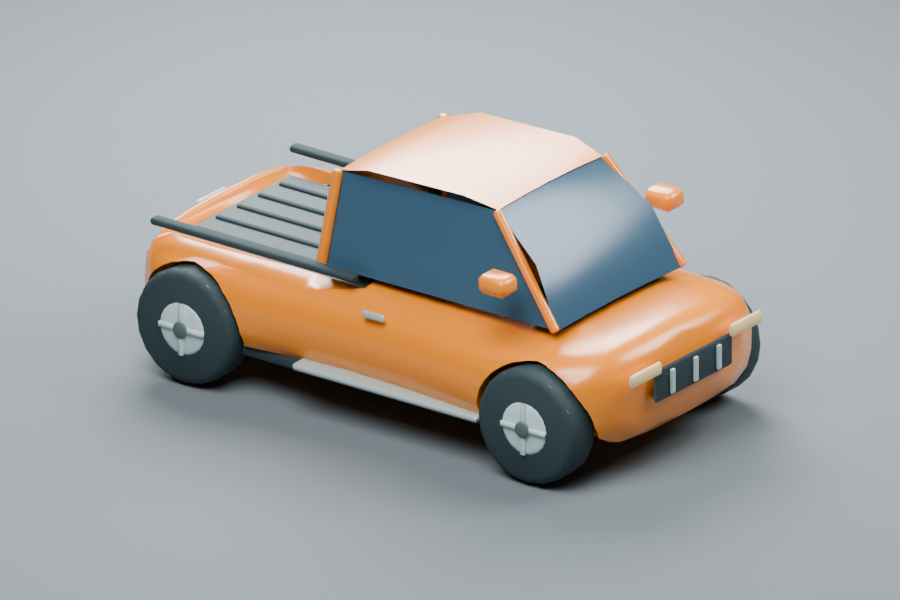
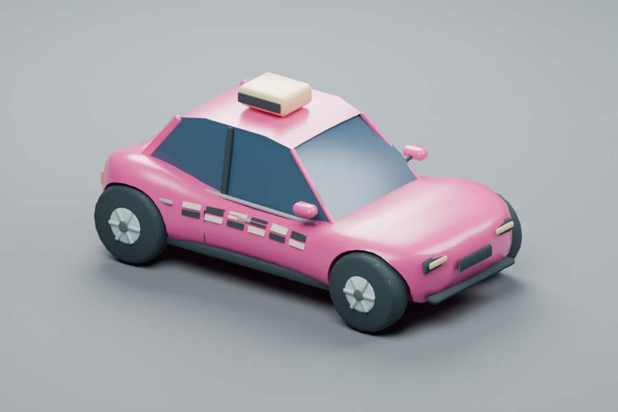
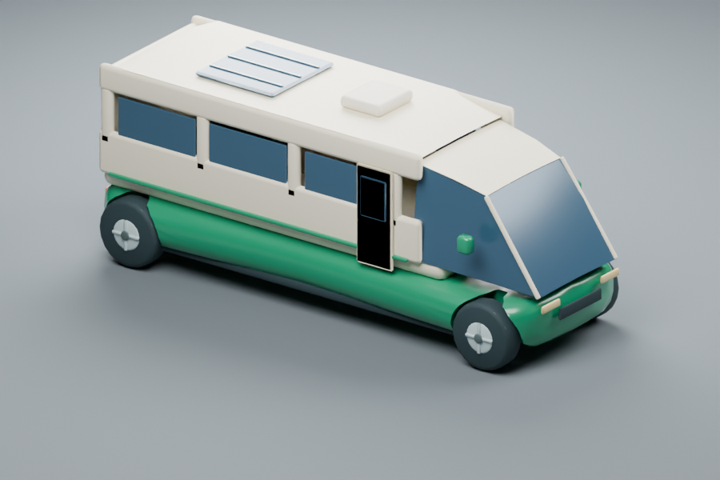

# Traffic Jam 全面改善與驗證

本輪依據 [前次十六項檢查](../audit-2026-10-05/REPORT.md) 實作。保留無聲遊玩、格位解謎規則與使用者認可的車身動態 120%。本地預覽：http://localhost:4173；修改在既有草稿 PR #2。

## 十六項改善對照

| 項目 | 本輪實作 | 驗證 |
| --- | --- | --- |
| 1. 穩定構圖 | 固定場景與訊息區；編輯控制獨立配置，不擠壓棋盤 | 提示與驗證前後的棋盤投影完全一致 |
| 2. 草稿保護 | 獨立自動保存的命名草稿，返回與重開可恢復；清空可復原 | 離開／重開／清空／復原／重做回歸 |
| 3. 存檔可靠性 | 結構驗證、相容舊存檔、容量與權限錯誤提示；保留損壞原文，修復前先保存恢復副本 | 格式錯誤、容量不足、修復備份的單元與瀏覽器測試 |
| 4. 關卡輸入 | 驗證車物件、有限整數座標、id、方向、車長、顏色與碰撞 | 不合法輸入回傳錯誤；40 關合法路線重播 |
| 5. UI 一致性 | 深綠／金色車庫介面、中文難度、關卡盤面縮圖與分組、獨立獎章 | 桌面／手機實際截圖檢查 |
| 6. 操作理解 | 可略過與重開的三步指南；車型、編號、位置與方向清楚的選車列 | 鍵盤移動／復原、Escape 關閉與焦點返回 |
| 7. 編輯流程 | 未儲存試玩、回草稿、命名、既有車拖曳、空白格拖放、方向／車長工具、衝突範圍提示、undo/redo | 草稿試玩、實際移車與復原、無效終點保留起點 |
| 8. 場景生命週期 | 共享單一 renderer、環境、道路與資產；切關只同步車輛；抓取即時更新世界座標 | 100 次切關的 instanceId 與幾何／紋理數量檢查，40 關拖曳 |
| 9. 求解效率 | 建置時預算 40 關路線；提示重用路線／狀態快取；緊湊 BFS 座標鍵與父節點路線重建 | 最佳路線合法性；搜尋超限與無解分開回報 |
| 10. 可操作性 | 設定／選車目標至少 44 px，提升字級；遊玩／展示視角預設與焦點樣式 | 375／320 px、200% 等效視窗、鍵盤與瀏覽器可及性樹 |
| 11. 車模美術 | 重製皮卡、計程車、露營車；巴士、校車與貨車增加真窗洞與內裝；精緻模式透光玻璃 | GLB 輪距／格位／車頭／座椅射線測試；單車渲染與遊戲多視角 |
| 12. 街景材質 | 共用材質圖集加入木紋、混凝土、葉片、金屬細節；保持街景合批及中央視覺焦點 | 日景／黃昏／霓虹構圖與繪製量量測 |
| 13. 車輛物理回饋 | 原有受阻／煞停阻尼上擴充前後軸載重與胎體壓縮；維持輪胎貼地與固定車道 | 30／60／120 Hz 動態、穩定性與觸控受阻測試 |
| 14. 通關收束 | 可立即查看成績以略過出庫演出；場景獎勵預覽；第 40 關顯示完成數、總星數、最佳解數 | 40 關通關、結果關閉／重玩、獎勵流程 |
| 15. 完整保存／離線 | 最近盤面與復原歷史、命名關卡、備份檔匯出／匯入；同 id 不同作品保留兩份；應用圖示與版本快取 | 真實檔案匯入、恢復盤面、離線重開與第 40 關素材 |
| 16. 程式維護 | 拆出編輯狀態、關卡瀏覽／縮圖、備份合併、盤面恢復、離線狀態；統一樣式 token、刪除重複覆寫；CI 瀏覽器回歸 | 單元測試、正式建置、草稿／存檔／40 關 CI |

## 證據與重跑方式

使用隔離 Chrome 與備份／還原的測試資料，不覆寫使用者的遊玩進度。瀏覽器腳本以真實 CDP 滑鼠／觸控輸入移車；按鈕流程另檢查狀態與存檔結果。

- `npm test`：規則、車模、收藏、物理、存檔與備份。
- `npm run build`：預算並重播 40 關路線，建置一致的 59 檔離線快照。
- `node scripts/verify-upgrade.mjs <CDP URL>`：構圖、草稿、接續遊戲、100 次切關、離線與 WebGL 重試。
- `node scripts/verify-resilience.mjs <CDP URL>`：損壞存檔、原文恢復副本、真實檔案匯入、容量不足、鍵盤與焦點。
- `node scripts/verify-all-levels.mjs <CDP URL>`：40 關真實滑鼠拖曳通關。
- `node scripts/verify-art.mjs <CDP URL>`：六種構圖、144 車身命中與棋盤四角。
- `node scripts/verify-touch.mjs <CDP URL>`：觸控受阻、吸附、取消、多點取消、三種畫質與九步通關。
- `node scripts/benchmark-render.mjs <CDP URL> docs/upgrade-2026-10-05/performance-evidence.json`：CPU 提交、GPU 計時、繪製量及輸入至提交樣本。

## 本機結果

- 全 40 關實際滑鼠拖曳通關，共 1,029 次；每關步數等於最佳解，進度寫入成功。`browser-level-evidence.json` 保存完整結果。
- 最後 UI 修正後另重播第 40 關 51 步，更新 `18-final-win.png`；這次針對性測試預置已通過路線的前 39 關成績，記錄於 `browser-range-evidence.json`。
- 六種桌面／手機構圖共 144 個車身抓取點、完整棋盤四角、無水平溢出。對應截圖已實際查看。
- 100 次切關共用一個 renderer，幾何資源 65–70、紋理 8，沒有持續增長。CI 回歸改為等待新關卡實際繪製後再比較，避免把尚未上傳資源的數量當成暖機基準；原始取樣保存於 `scene-switch-samples.json`。軟體繪圖環境的切關至新盤面已繪製 p95 約 1,219 ms，含按鈕等待及輪詢，詳見 `verification.json`；不能當作有 GPU 裝置的延遲。
- 真實觸控九步通關、受阻回正、近車身容錯、吸附、取消、多指取消、三種畫質與場景獎勵皆通過。
- 損壞存檔保留原文、修復副本、真實 JSON 檔案匯入、空白格放車、既有車拖曳、編輯復原、容量不足與鍵盤焦點皆通過。
- 待機約 30 FPS，零待機陰影更新；離屏零繪製。數據為 `idle-evidence.json`。
- 所有 GLB 合計 3,430,876 bytes，較前輪增加約 3.9%；新增窗洞與內裝有資產成本，沒有宣稱美術增加後所有效能指標都降低。

| 標準畫質拖曳 p95 | 日景桌面 | 夜景桌面 | 夜景手機模擬 |
| --- | ---: | ---: | ---: |
| CPU 繪製提交 | 2.9 ms | 2.6 ms | 2.5 ms |
| GPU 計時 | 11.05 ms | 15.52 ms | 12.87 ms |
| 輸入至提交 | 3.4 ms | 3.2 ms | 3.0 ms |
| 繪製呼叫 | 125 | 126 | 126 |
| 三角形（含陰影） | 177,054 | 177,062 | 177,062 |

每組各有 90 個實際拖曳輸入樣本，原始資料為 `performance-evidence.json`。同主題繪製呼叫較前次約 137 次減少；幾何數量略增。不同輪次 GPU 計時會受主機狀態影響，不能把差異全部歸因於程式。

低幀率觸控回歸另找到兩個問題並修正：初次載入的暫存盤面與正式第 1 關使用相同場景識別，導致車身初始位置漸移；以及每幀 40 ms 時間上限使低於 25 FPS 時懸吊回正拖慢。現在分開初始化識別，阻尼用最高 100 ms 的實際時間步進，補上 10／20 Hz 回正測試，原本 30／60／120 Hz 行為保持通過。

首次啟用離線功能後再遇到新版，原本更新控制可能保留「首次尚未被控制」的舊判斷，啟用新 worker 卻不重載。修正為追蹤第一次接管及玩家更新意圖，新增實際 worker 版本切換、恢復正式版本與進度／草稿保留測試。`11-offline-update.png`、`12-update-active.png` 保存更新前後畫面。

## 測試範圍

物理是確定性格位控制下的車身／輪胎回饋，沒有自由駕駛剛體或完整輪胎摩擦求解器。手機測試使用桌面 Chrome 的尺寸、DPR 與觸控模擬；尚未使用真手機、NVDA／VoiceOver 或低階實機長時間測試。瀏覽器可及性樹與鍵盤測試不能取代實際螢幕閱讀器測試。

輸入至提交量測止於 renderer 提交，並非螢幕光子延遲；GPU 計時受主機與其他應用影響。切關 p95 包含測試腳本的按鈕等待與輪詢，不能當作純 renderer 初始化耗時。Three.js 動態載入 chunk 仍有超過 500 kB 的建置提示。

離線快取以內容雜湊版本隔離完整資產；初次下載失敗不宣告離線就緒。更新需玩家按更新按鈕，啟用後重新載入，避免混用新舊素材。PWA 圖示提供 SVG；各手機的安裝介面仍需實機驗收。

## 畫面

